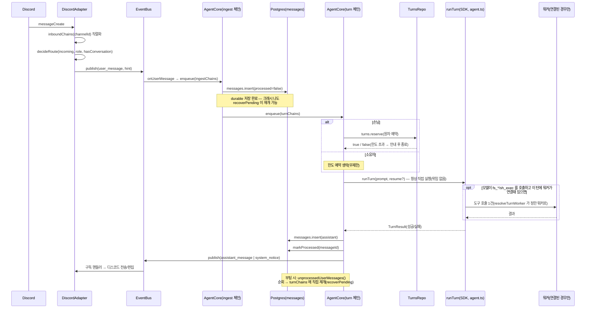

# 메시지 데이터 흐름 (수명주기)

디스코드 메시지 한 통이 도착해서 답장이 나가기까지 거치는 전체 경로를 다룬다. 3-프로세스
토폴로지(봇/워커/DB)의 상위 구조는 `overview.md`를 먼저 참고하고, 이 문서는 그 안의
"봇이 메시지 하나를 어떻게 처리하는가"에 집중한다. 동시성·크래시 복구가 얽히는 가장 까다로운
정합성 지점이므로, 서술한 사실은 모두 코드 원문을 근거로 한다.

## 1단계 — Discord 인입: `messageCreate` → `decideRoute` → `publish`

어댑터(`agent/src/adapters/discord.ts`)는 `client.on("messageCreate", ...)`에서 메시지를
받으면 곧바로 처리하지 않고, `channelId`를 키로 하는 `inboundChains`에 태워 채널별로
직렬화한다. `getRole`/`getByChannelId`가 원격 Postgres 왕복인 비동기 호출이라, 직렬화 없이
매 메시지를 fire-and-forget 하면 같은 채널에 빠르게 도착한 A→B 두 메시지의 조회가 도착
순서와 다르게 끝나 응답·저장 순서가 뒤바뀔 수 있기 때문이다(`discord.ts`의 `inboundChains`
주석).

큐잉된 `onMessage`는 다음을 순서대로 한다.

1. role 조회(`users.getRole`)와 그 채널의 기존 대화 존재 여부(`conversations.getByChannelId`)를 확인한다.
2. 순수 함수 `decideRoute(incoming, role, hasConversation)`을 호출한다. 이 함수는 부수효과가
   전혀 없어 유닛테스트하기 쉽게 분리돼 있으며, 다음 여섯 가지 중 하나로 판정한다.
   - `ignore` — role이 `owner`/`allowed`가 아니면(미등록·blocked) 무조건 무시(응답 게이트).
   - `dm` — DM.
   - `thread-existing` — 이미 `conversations` 행이 있는 스레드/채널(멘션 불필요, 대화 지속).
   - `thread-create` — 일반 채널에서 봇이 직접 `@멘션`됨 → 새 스레드 생성.
   - `adopt-thread` — 아직 대화가 아닌 스레드에서 `@멘션`됨 → 그 스레드를 채택.
   - `channel-command` — 일반 채널에서 멘션 없이 예약어(`/대회`·`/개발뉴스`·`/help`)만 보냄 →
     스레드도 대화도 만들지 않고 그 자리에서 처리(`core/commands.ts`의 `isChannelCommand`).
3. `ignore`가 아니면 `resolveHint`로 라우팅 결정을 `ConversationHint`(대화 매핑 힌트)로
   바꾼다. `thread-create`만 스레드 생성이라는 부수효과를 가지며, 실패 시(권한 부족 등)
   원 채널을 그대로 대화로 채택하는 인플레이스 폴백을 쓴다.
4. `beginTurn`으로 원본 메시지에 처리중 반응(👀)을 달고, `bus.publish`로
   `user_message` 이벤트(`channel`, `channelRef`, `text`, `ts`, `hint`, `images?`)를
   이벤트버스(`agent/src/events/bus.ts`)에 올린다.

이 시점부터 어댑터는 손을 뗀다 — 실제 처리는 코어가 `user_message`를 구독해서 시작한다.

## 2단계 — 코어의 두 체인: ingest와 turn

`AgentCore`(`agent/src/core/core.ts`)는 `start()`에서 `bus.subscribe("user_message", ...)`로
구독을 건다. 구독 핸들러(`onUserMessage`) 자체는 동기이며 게이트를 다시 한 번 확인한 뒤
**ingest 체인**에 작업을 넣기만 하고 끝난다 — 실제 비동기 작업(그리고 그 오류 처리)은
큐에 들어간 태스크 안에서 일어난다.

코어는 채널(`discordChannelId`)별 직렬 처리를 **ingest 체인**과 **turn 체인**, 두 개의
독립된 `Map<string, Promise<void>>`로 나눠서 관리한다(`ingestChains`, `turnChains`,
`core.ts:70` 부근). 두 체인 모두 같은 `discordChannelId`를 키로 쓰지만 서로 다른 큐이므로,
한쪽이 밀려도 다른 쪽 진행을 막지 않는다.

### ingest 체인 — durable 저장(짧다)

`ingest(hint, ts, text, images)`가 하는 일은 다음과 같다(`core.ts:142`).

1. `hint.commandOnly`(일반 채널에서 멘션 없이 받은 예약어)면 대화 행을 조회·생성하지 않고
   그 자리에서 바로 처리한 뒤 반환한다 — `/help`면 안내를 발행하고, 조사 예약어(`/대회`·
   `/개발뉴스`)면 `conv: null`로 `startDigestCommand`를 호출한다. 아래 2~5단계(대화 조회·
   메시지 저장·turn 체인 enqueue)는 전혀 거치지 않는다 — 이 채널이 대화로 굳어 이후 모든
   메시지에 봇이 답하기 시작하는 것을 막는 이 경로의 핵심 불변식이다.
2. (`commandOnly`가 아니면) `resolveConversation`으로 대화 행을 확정한다(멱등:
   `discord_channel_id` → `origin_message_id` → 없으면 생성). 유휴로 닫혔던 대화면
   `active`로 재활성한다.
3. 예약어 세션 명령(`/새세션`·`/기억정리`)이면 메시지를 저장하지 않고 종료한다. 다만 두
   명령의 **본문은 turn 체인에 enqueue**해서 실행한다(`/새세션`은 `resetSession`,
   `/기억정리`는 `compactSession`). ingest 안에서 곧바로 실행하면, 이미 turn 체인에서
   돌고 있던 대화 턴이 나중에 `setSession`을 써서 방금 비운 세션을 되살린다 — 바닥선은
   그어졌는데 세션은 살아 있어 다음 턴이 옛 SDK 세션을 resume 하고, 페르소나 재적용도
   대화 끊기도 둘 다 실패하면서 사용자에게는 됐다고 알린 상태가 된다. 답장이 생성되는
   중에 명령을 치면 실제로 그렇게 된다. 그래서 두 명령은 진행 중인 턴 뒤에 줄을 선다.
   `/새세션`은 여전히 LLM 턴을 쓰지 않고, `/기억정리`는 요약 턴 하나를 쓴다.
   두 본문 모두 **어떤 경로로 끝나든 정확히 한 건을 발행한다**(`commandFailed`) —
   `runConversationTurn`의 catch 와 같은 이유다. 어댑터는 이 메시지를 큐에 넣는 시점에 이미
   ⏳ 를 달고 채널별 FIFO(`pendingTriggers`)에 밀어 넣었고, 그 큐는 나가는
   `assistant_message`·`system_notice` 한 건마다 하나씩 꺼내진다. 한 건도 안 나가면 그 채널의
   이후 모든 턴이 한 칸씩 밀린 엉뚱한 메시지에 ✅ 를 단다.
4. 참가자를 upsert하고, **`processed=false`로 사용자 메시지를 먼저 저장**한다
   (`messages.insert(..., processed: false)`). 저장하는 내용은 이미지가 있어도 원문
   재주입 없이 마커(`buildImageMarker`)만 남긴다.
5. 저장이 끝나면 이 대화의 실제 LLM 처리를 **turn 체인**에 새로 enqueue하고 반환한다.

ingest 자체는 DB insert 한두 번 정도로 짧기 때문에, 채널별로 직렬화해도 버스트가 금방
소진되어 도착한 메시지가 모두 빠르게 durable 저장된다.

### turn 체인 — LLM 턴(길 수 있다)

turn 체인에 들어간 `runConversationTurn(convId, userId, role, text, messageId, images)`이
실제 LLM 처리를 맡는다(아래 3단계). 이 체인도 채널(=대화)별로 직렬화되어 있어 "같은 대화
재진입 금지" 불변식을 유지한다 — 한 대화 안에서 턴 두 개가 동시에 SDK 세션을 건드리는
경합이 나지 않는다.

### 왜 두 체인으로 분리했는가

`core.ts:77` 부근 주석 그대로: 하나의 체인에 ingest와 turn을 함께 묶으면, 앞선 메시지의
긴 LLM 턴이 끝날 때까지 뒤이은 메시지는 **insert조차 되지 못한다**. 그 사이 프로세스가
죽으면 아직 저장되지 않은 메시지는 DB에 `processed=false` 행 자체가 없으므로 부팅 시
`recoverPending`이 복구할 대상이 없어 **영구 유실**된다. ingest와 turn을 분리하면 durable
저장은 LLM 턴의 길이와 무관하게 항상 빠르게 끝나므로, 크래시가 나더라도 "저장은 됐지만
아직 처리는 안 된" 메시지만 남고 그 메시지는 반드시 `recoverPending`이 재개할 수 있다.

## 3단계 — turn 처리: 한도와 실행

`runConversationTurn`은 대화별 신원(`isOwner = userId === config.ownerId`, role이 아니라
신원으로 판정)에 따라 갈라진다.

- **소유자**: 한도 예약을 생략한다(`turns` 테이블에 기록조차 하지 않음 — 손님 카운트에도
  영향 없음).
- **손님**: `turns.reserve(...)`로 유저별+전역 한도를 **원자적으로** 예약한다
  (`agent/src/store/turnsRepo.ts`). Postgres advisory lock(`pg_advisory_xact_lock`)으로
  전역 직렬 지점을 만들어, 두 요청이 동시에 카운트를 읽고 둘 다 한도 통과로 착각하는 경합을
  막는다. 예약 실패면 한도 안내 메시지만 보내고 턴 자체를 종료한다.

한도 통과 후(또는 소유자라 처음부터 무제한), **코어는 예외 없이 자신의 SDK 세션으로
`runTurn`을 직접 실행한다** — 대화 턴 전체를 다른 프로세스에 넘기는 위임은 존재하지 않는다
(`docs/decisions/0006-thin-worker.md`로 이미 제거됐다. 이 문서의 옛 판이 서술하던
`delegateToWorker`/`worker_jobs` 큐 기반 위임은 그보다도 이전 모델이며 지금 코드베이스
어디에도 없다). 성공하면 `assistant_message`로 응답을, 실패하면 `system_notice`로 오류
안내를 발행한다. 이미지가 있어도 처리 경로가 갈라지지 않는다 — `runTurn` 호출 전에 이미지를
다운로드해 멀티모달 프롬프트에 실을 뿐이다.

`runConversationTurn`은 `runTurn`을 부르기 직전에 `resolveTurnWorker`
(`agent/src/core/agent.ts`)를 한 번 호출해 `workerConnected`(이 턴에 실제로 붙는 워커가
있는가)를 구하고, 그 값을 페르소나 시스템 프롬프트(`buildSystemPrompt`)의 능력 안내에
싣는다 — "PC 작업이 가능하다"는 안내가 실제 도구 노출과 어긋나지 않게 하기 위해서다.
**다만 이건 안내용 계산이다**: 실제로 어느 도구가 열리고 어느 워커로 호출이 나가는지는
`runTurn`(`agent/src/core/agent.ts`의 `makeRunAgentTurn`)이 같은 `resolveTurnWorker` 판정을
내부에서 독립적으로 다시 계산해 정한다. `resolveTurnWorker`는 `resolveWorkerSelector`
(`agent/src/core/workerSelect.ts`)의 "어디서 말하느냐가 어느 기계냐를 정한다" 규칙으로 이
턴이 개인 워커(소유자 DM)를 쓸지 공유 워커(그 외 전부)를 쓸지 고르고, `WorkersRepo` 레지스트리
(`agent/src/store/workersRepo.ts`)로 실제 `workerId`를 찾은 뒤 `hub.isConnected(workerId)`로
연결 여부를 확인한다. 워커 자체의 인증(연결 시점의 `hello` → 레지스트리 조회 → `ready`/
`denied`)과 도구 호출 하나하나가 워커로 전달되는 경로는 이 문서의 범위 밖이다 —
`docs/architecture/overview.md` "원격 도구 호출" 절, `docs/security/capability-model.md`를
참고한다.

턴 처리가 끝나면(성공·실패·예외 모두) **`finally`에서 `messages.markProcessed(messageId)`를
호출**해 그 사용자 메시지를 `processed=true`로 닫는다.

`assistant_message`를 받은 뒤 실제로 내보내는 순서는 어댑터의 몫이다
(`agent/src/adapters/discord.ts`) — 채널별로 `sendChains`를 직렬화하는 `enqueueSendAfter`가
등록된 호출 순서(= 이벤트가 publish된 순서)대로 나가는 것을 보장한다. 이 순서 보장은 원래
표정 마커(`[표정:이름]`)를 이미지로 바꿔 붙이는 단계(`resolveExpression`)와 같은 메서드 안에
있었지만, 순서를 지켜야 하는 이유 자체는 표정과 무관했다 — 같은 채널에 빠르게 이어진 두
응답이 등록 순서와 다르게 나가면 안 된다는 요구가 근거였다. 2026-08-05 표정 이미지 기능
제거로 마커 해석 단계는 사라졌고, 채널별 직렬화 구조와 순서 보장만 그대로 남았다.

## 크래시 복구 불변식

`processed=false`로 먼저 저장 → 부팅 시 `recoverPending`이 재개, 라는 두 지점이 크래시
복구의 전부다.

- **저장 시점**: ingest 체인의 `messages.insert`가 `processed=false`로 행을 만드는 순간이
  "이 메시지는 반드시 처리된다"는 계약의 시작점이다. 이 insert가 끝난 뒤에 프로세스가
  죽어도, 메시지는 DB에 남아 있다.
- **재개 시점**: 부팅 시 `AgentCore.recoverPending()`(`core.ts:436`)이
  `messages.unprocessedUserMessages()`(`processed=false`인 user 메시지 전체, id 오름차순)를
  조회해 각 메시지를 그 대화의 **turn 체인에 직접** enqueue한다(ingest 체인을 다시 거치지
  않는다 — 이미 저장은 끝났으므로). role이 더 이상 `owner`/`allowed`가 아니면(예: 그 사이
  차단됨) 처리 없이 바로 `markProcessed`로 닫는다.

즉 ingest가 끝난 시점부터 turn이 `finally`에서 `markProcessed`를 호출하는 시점까지의
구간에서 프로세스가 죽어도, 그 메시지는 다음 부팅 때 정확히 한 번 더 재개된다.

## 시퀀스 다이어그램

## 관련 문서

- 3-프로세스 토폴로지 전체, 위임이 없는 이유, 워커 인증·원격 도구 호출 상세: `overview.md`
- 능력 계층·도구 게이팅: `docs/security/capability-model.md`
