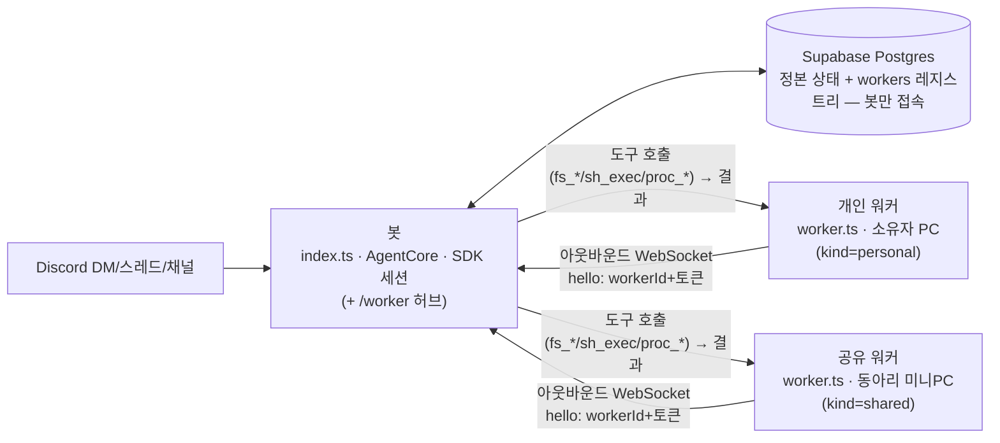

# 아키텍처 개요

Asahi 비서는 **봇**과 **워커**, 두 프로세스로 나뉘어 상시 운영된다. 판단(모델 호출·기억·
세션·한도)은 전부 봇 쪽에 있고, 워커는 봇이 원격으로 호출하는 파일/셸 도구 하나하나를
자신의 PC 위에서 대신 실행하는 얇은 실행기다(`docs/decisions/0006-thin-worker.md`). 하나의
모놀리식 서버가 아니라, 서로 다른 신뢰 경계에서 도는 두 프로세스가 WebSocket 하나로
연결되고, **봇만** 정본 상태 저장소(Supabase Postgres)에 접속하는 구조다 — 워커는 DB
자격증명을 아예 갖지 않는다.

## 세 구성 요소

### 봇 (`agent/src/index.ts`)

Railway(24/7) 또는 로컬 PM2로 상시 구동되며, 디스코드에 연결해 모든 대화(소유자 DM·손님
DM·서버/스레드)를 받아들이는 유일한 진입점이다. `AgentCore`(`agent/src/core/core.ts`)가
대화별 직렬 처리·세션 관리·한도(rate limit)를 담당하고, **매 턴을 예외 없이 자신의 Claude
Agent SDK 세션으로 직접 실행한다** — 위임이라는 개념은 이제 없다(아래 "위임이 사라진 자리"
참고). 모델이 파일/셸 도구를 호출하면, 그 개별 호출 하나만 워커에게 원격으로 보내고 결과를
기다린다(아래 "원격 도구 호출").

봇은 워커가 아웃바운드로 접속하는 유일한 표면도 함께 연다 — HTTP 서버(`/health`)와, 그
서버 위에서 `/worker` 경로로 WebSocket 업그레이드를 받는 허브(`agent/src/remote/hub.ts`의
`WorkerHub`)다(`agent/src/index.ts`). **이것이 봇이 갖는 최초의 공개 네트워크 리스너다**
— 예전에는 디스코드 게이트웨이에 나가는 연결만 있었지, 들어오는 연결을 받는 서버가 없었다.

`agent/src/config.ts`의 `loadConfig`가 환경변수 `DEPLOY_TARGET`을 읽어 `deployTarget`을
결정하는데, 정확히 `"cloud"`일 때만 `cloud`로 판정한다(그 외 미설정·오타는 모두 `local`).
`allowedToolsFor`(`agent/src/core/tools.ts`)는 이 값을 인자로 받지만 함수 본문 어디에서도
분기에 쓰지 않는다 — 파일/셸 작업(`fs_*`/`sh_exec`)과 허용 폴더 관리 도구(`allow_dir`/
`revoke_dir`/`list_dirs`) 모두 지금은 오직 아래 "워커 연결" 여부(`workerConnected`)만으로
결정된다. `deployTarget`은 `runtime_info` 도구가 보고하는 배포 정보로만 의미가 남아 있어
시그니처에는 그대로 있다(`docs/security/capability-model.md` 참고). 컨테이너 자체는
무상태(stateless)다 — 재배포되어도 대화·기억은 Supabase Postgres에 남아 있으므로 데이터가
사라지지 않는다.

### 워커 (`agent/src/worker.ts`) — 개인 워커·공유 워커

소유자 PC(또는 동아리 공용 미니PC 등 소유자가 지정한 다른 기계)에서 실행되는 별도
프로세스다. 디스코드에도 DB에도 붙지 않는다. 각 워커는 `workers` 테이블(레지스트리,
`agent/src/store/workersRepo.ts`)에 등록된 자기 고유의 `id`와 `kind`(`personal`|`shared`)를
가지며, 갖고 있는 자격증명은 그 워커 자신의 토큰(`WORKER_TOKEN`) 하나뿐이다
(`agent/src/config.ts`의 `loadWorkerConfig`는 `databaseUrl`도 `model`도 요구하지 않는다).
워커 등록·토큰 발급은 `npx tsx src/scripts/registerWorker.ts`(`agent/src/scripts/registerWorker.ts`)로
하며, 발급된 토큰은 그 자리에서 한 번만 출력되고 DB에는 해시만 남는다(절차는
`deploy/worker-셋업.md` 참고). 기동하면 `HUB_URL`(봇의 `/worker` WebSocket 주소)로 아웃바운드
연결을 열고, `hello` 프레임으로 자신의 `workerId`·토큰·자신이 노출할 폴더 목록
(`WORKER_ROOTS`)을 보낸다(`agent/src/remote/workerClient.ts`). 허브는 `workerId`로
레지스트리를 조회해 토큰 해시를 대조하고, 성공하면 `ready`를 돌려준다 — 워커 콘솔에
`준비됨`이 찍힌다. 그 뒤로는 봇이 보내는 개별 도구 호출(`call` 프레임)을 실행기
(`agent/src/remote/executors.ts`)로 실행하고 결과(`result` 프레임)를 돌려주는 것 말고는
아무것도 하지 않는다 — 대화 이력도, 시스템 프롬프트도, SDK 세션도 워커 쪽에는 없다.

허브는 동시에 여러 워커의 연결을 유지한다(`workerId`로 키잉) — 소유자의 개인 워커와 동아리
공유 워커가 동시에 붙어 있는 것이 1단계의 정상 상태다. 같은 `workerId`로 재연결하면
이전 연결만 정리된다(`dropExisting`) — 다른 워커의 연결에는 영향이 없다.

연결이 끊기면 고정 간격(기본 3초, 지수 백오프 아님)으로 재연결을 시도한다
(`agent/src/remote/workerClient.ts`). 인증에 실패(`denied`)하면 재연결 자체를 멈추고
사람이 설정을 고치길 기다린다 — 토큰이 틀렸는데 계속 재시도해 봐야 결과가 같기 때문이다.
"등록되지 않은 `workerId`"와 "토큰 불일치"는 같은 거부 문구로 응답된다(인증 오라클 방지,
`agent/src/remote/hub.ts`의 `DENIED_REASON`).

### Supabase Postgres (정본 상태)

**봇만** 접속하는 정본(source of truth) 저장소다. 연결은 Supabase의 **Session pooler**
연결 문자열(`DATABASE_URL`)을 통해 이뤄지며(`agent/src/store/db.ts`의 `openDb`), 스키마는
`agent/src/store/schema.ts`에 정의된다. 유저·대화·메시지·기억이 이 안에 있다.
`worker_jobs`·`worker_heartbeats` 테이블은 예전 위임 모델의 흔적으로 DDL만 남아 있고,
지금은 어떤 코드도 이 두 테이블을 읽거나 쓰지 않는다(`schema.ts` 주석,
`docs/decisions/0006-thin-worker.md`) — 마이그레이션 위험을 피하려고 테이블 자체는
지우지 않았을 뿐이다.

## 원격 도구 호출

봇의 SDK 세션이 파일/셸 작업이 필요하면, SDK 내장 도구(Read/Write/Edit/Glob/Grep/Bash)
대신 인프로세스 MCP 도구 11종(`fs_read`/`fs_write`/`fs_edit`/`fs_glob`/`fs_grep`/`fs_tree`/
`sh_exec`/`proc_start`/`proc_stop`/`proc_list`/`proc_logs`, `agent/src/core/tools.ts`)을
호출한다 — 내장 Read/Write/Edit/Glob/Grep/Bash는 `query()`에 넘기는 내장 도구 허용
배열(코드상 변수명 `builtinTools`)에 한 번도 실리지 않아 항상 닫혀 있다(`agent/src/
core/agent.ts`). 그 배열이 실제로 여는 것은 웹 검색(`WebSearch`)과 스킬(`Skill`, 아래
"스킬" 문단)뿐이며, 둘 다 조건부로만 실리고 사람이 지켜보지 않는 유휴 대화 요약 턴에서는
함께 닫힌다. 파일/셸 도구들의 핸들러(`agent/src/core/remoteTools.ts`의
`remoteToolHandler`)는 이 턴에 워커가 배선돼 있는지(`ctx.remote`) 확인하고 경로를 1차로
거른 뒤, `WorkerHub.call`(`agent/src/remote/hub.ts`)로 그 턴이 쓰는 워커에게 도구 이름과
인자를 실어 보내고 결과를 기다린다.

- **연결 여부가 도구 노출을 결정한다** — `resolveTurnWorker`(`agent/src/core/agent.ts`)가
  매 턴 이 턴이 쓸 워커를 정한다: `resolveWorkerSelector`(`agent/src/core/workerSelect.ts`)의
  "어디서 말하느냐가 어느 기계냐를 정한다" 규칙(소유자 DM → 그 소유자의 개인 워커, 그 외
  전부 — 소유자의 서버 채널·손님의 DM·서버 — → 공유 워커)으로 개인/공유를 고르고,
  `WorkersRepo` 레지스트리로 실제 `workerId`를 찾은 뒤 `hub.isConnected(workerId)`로 연결
  여부를 확인한다. 연결돼 있으면 `ctx.remote`를 채우고 `allowedToolsFor`에 원격 도구를
  포함시킨다. 연결돼 있지 않으면 원격 도구 자체가 도구셋에 나타나지 않는다. 판정은 **턴
  시작 시점**에 한 번 이뤄진다 — 턴 도중 연결이 끊기면 이후 개별 도구 호출이 실패로 돌아올
  뿐, 이미 시작된 턴을 중단시키지는 않는다.
- **타임아웃은 도구 하나만 실패시킨다** — `WorkerHub.call`은 기본 120초 안에 응답이 없으면
  그 호출만 실패로 모델에 돌려준다(`ok: false`). 턴 전체가 죽지 않으므로 모델이 다른
  방법을 시도하거나 사용자에게 실패를 알릴 수 있다.
- **경로 검사는 두 겹, 손님은 한 겹 더 좁혀진다** — 봇 쪽 `allowed_dirs`(그 워커 기준) 1차
  필터와 워커 쪽 `WORKER_ROOTS` 최종 판정을 모두 통과해야 한다. 공유 워커에서 손님(소유자가
  아닌 사용자)은 `scopeDirs`(`agent/src/core/workerSelect.ts`)가 1차 필터의 허용 폴더를
  자기 하위 폴더(`<루트>/<디스코드 userId>/`)로 더 좁힌다 — 소유자는 관리자이므로 좁히지
  않는다. `sh_exec`는 경로 인자가 없어 이 필터·스코프 어디에도 속하지 않는다 — 손님이라도
  실행 시 작업 디렉토리와 워커 프로세스의 OS 권한만이 경계다. 자세한 내용은
  `docs/security/capability-model.md` "경로 게이팅" 참고.
- **1단계는 개인 워커 + 공유 워커, 워커별 토큰** — 각 워커는 `workers` 테이블에 등록된
  자기 고유의 `id`와 해시된 토큰을 갖는다(`docs/superpowers/specs/
  2026-07-27-multi-worker-design.md`). 소유자는 자신의 개인 워커(DM)와 동아리 공유 워커
  (서버 채널)를 함께 쓰고, 손님은 DM·서버 어디서든 그 공유 워커의 본인 폴더로만 좁혀진다.
  허브는 워커별로 동시에 여러 연결을 유지하며, 같은 `workerId`로 재연결하면 그 워커의
  이전 연결만 정리된다(`agent/src/remote/hub.ts`의 `dropExisting`). 손님이 자기 PC에
  개인 워커를 두는 것은 여전히 지원하지 않는다 — 소유자의 구독으로 도는 작업이 소유자가
  보지 못하는 기계에서 벌어지는 것을 피하기 위한 의도된 설계다(§2.1,
  `docs/superpowers/specs/2026-07-27-multi-worker-design.md`).
- **스킬(2026-08-01)** — 위에서 말한 `Skill`은 원격 도구가 아니라 SDK 가 로컬에서 직접
  읽는 문서다. `agent/skill-plugin/`가 로컬 플러그인 하나로 모든 스킬을 담고, `query()`의
  `plugins`(플러그인 경로 목록)와 `skills`(`'all'` 고정) 옵션으로 로드된다. 폴더 안이
  `skill-plugin/skills/<이름>/SKILL.md`로 한 겹 더 들어간 것은 오타가 아니라 SDK 규약이다
  — SDK 는 플러그인 루트 바로 밑이 아니라 `<루트>/skills/<이름>/SKILL.md`를 스캔한다(실측
  확인, 첫 스킬은 `skill-plugin/skills/frontend-design/SKILL.md`). 외부 스킬을 들이는
  절차는 그 폴더 밑에 통째로 복사해 커밋하는 것뿐이다. **스킬 문서는 봇 컨테이너 안에
  있고, 파일·셸을 실제로 실행하는 쪽은 워커다** — 이 둘이 서로 다른 프로세스라는 비대칭
  때문에 지금은 `SKILL.md` 본문을 읽고 지침만 따르는 문서형 스킬만 동작하고, 스크립트
  실행이 필요한 스킬(예: 빌드 스크립트를 동봉한 스킬)은 봇이 그 스크립트를 워커에게 넘겨
  실행을 위임하는 다음 단계가 있어야 한다. 그 다음 단계가 파일 배치 자체를 새로 걱정할
  일은 아니다 — 미니PC 공유 워커는 이미 `update-worker.ps1`(`deploy/update-worker.ps1`)의
  `git pull --ff-only`로 봇과 같은 `agent/skill-plugin/`를 자동 갱신 받고 있으므로, 남은
  것은 파일을 나르는 문제가 아니라 워커가 그 파일을 어떤 이름의 도구 호출로 실행할지
  정하는 경로 규약 문제다.

## 위임이 사라진 자리

예전에는 소유자 DM이고 이미지가 없는 턴을, 봇이 직접 처리하지 않고 소유자의 로컬 워커에
**대화 턴째로** 넘겼다 — 워커가 `worker_jobs` 큐에서 job을 읽어 자신의 DB 자격증명으로
대화 이력을 직접 조회하고, 자신의 Claude 구독으로 SDK `query()`를 직접 호출하고, 결과를
다시 DB에 썼다(`worker_heartbeats`로 생존 신호를 찍어 봇이 "온라인"을 판정). 이 메커니즘은
얇은 워커 전환(`docs/decisions/0006-thin-worker.md`)으로 완전히 제거됐다 —
`AgentCore.runConversationTurn`은 더 이상 위임 분기를 갖지 않는다.

지금은 **모든 턴이 예외 없이 봇에서 실행되며**, 워커가 대신하는 것은 그 턴 안에서 모델이
호출하는 개별 파일/셸 도구뿐이다. 이미지가 있는 턴도 더 이상 특별 취급하지 않는다 — 예전
위임 조건이던 "이미지 없음"은 턴 전체를 워커로 넘길지를 가르던 조건이었는데, 그런 통짜
위임 자체가 없어졌으므로 이제는 이미지가 있는 턴에서도 같은 턴 안에서 원격 도구를 쓸 수
있다.

## 컨텍스트 블록

`AgentCore`가 새 SDK 세션을 여는 순간 — 열린 세션이 없거나 유휴 시간을 넘겼을 때, 그리고
재배포 등으로 resume 이 실패해 재시도할 때(둘 다 `agent/src/core/core.ts`) — `buildContextBlock`
(`agent/src/core/turnPrep.ts`)이 시스템 프롬프트 뒤에 붙일 블록 하나를 조립한다. 네 섹션 모두
각자 상한을 갖는다 — 예전에는 기억 섹션 하나만 무제한이었고, 지금은 그 구멍이 막혔다.

- **내 설정**(캐릭터 확정 설정, `scope='character'`) — 최대 40건(`CHARACTER_FACT_LIMIT`). 상한을
  하나 더 조회해 잘림 여부를 확인하고, 넘으면 오래된 것(id 오름차순 앞쪽)만 남기고 로그를
  남긴다 — 조용히 자르면 "설정을 다 기억한다"고 오해하게 된다.
- **기억**(개인/공용) — 건수가 아니라 문자 예산, 6,000자(`MEMORY_SECTION_BUDGET`,
  `agent/src/core/memoryScope.ts`). 공용 기억은 부원 누구나 늘릴 수 있어 건수 상한만으로는 못
  막는다(기억 1건 상한이 이미 4,000자라 50건이면 최대 20만 자). 예산을 넘긴 기억은 잘라내지
  않고 제목만 남긴다 — 내용이 잘리면 모델에게 그 기억의 존재 자체가 안 보여 `recall`할 생각도
  못 하지만, 제목이 남으면 "그 주제가 있다"는 것을 알고 가져올 수 있다(`renderMemories`). 목록의
  첫 건은 예산을 이미 넘겼어도 항상 전문으로 싣는다 — 안 그러면 기억 하나가 커서 섹션 전체가
  제목만 남는 색인이 된다. `recall` 도구 자체는 이 예산 밖이다 — 사용자가 명시적으로 물어본
  결과를 잘라낼 이유가 없다.
- **이전 대화 요약** — 최대 3건, 최신순.
- **최근 대화 기록** — 최대 20건.

## 컨텍스트 바닥선

`conversations.context_floor_ts`(`agent/src/store/conversationsRepo.ts`)는 "이 시각 이전의
대화 내용은 다음 컨텍스트 블록에 싣지 않는다"는 표시다. 데이터를 지우는 게 아니라 안 싣는다는
표시일 뿐이라 `messages`·`conversation_summaries` 행은 그대로 남고, 소유자는 `db_query`로
여전히 조회할 수 있다. NULL이면 바닥선이 없다는 뜻(이 기능 배포 이전 대화는 전부 해당)이고,
이 값을 긋는 명령은 둘뿐이다(`agent/src/core/commands.ts`의 `parseSessionCommand`).

- **`/새세션`**(별칭 `/새대화`·`/새로시작`·`/reset`) — `session_id`를 비워 다음 턴에 새 SDK
  세션(현재 페르소나 적용)을 열고, 지금 시각으로 바닥선을 그어 이전 대화·요약을 그 새 세션에
  안 싣는다. 그리고 `scope='character'` 기억(대화 중 즉흥으로 지어낸 신상)을 **전역으로, 되돌릴
  수 없이** 지운다 — 이 스코프는 유저·대화 단위가 아니라 방을 가리지 않는 값이라(소유자에게
  한 말이 손님에게도 같아야 하므로), 어느 방에서 쳐도 모든 방의 캐릭터 설정이 함께 지워진다.
  `scope='user'`(개인 기억)·`scope='shared'`(동아리 공용 기억)는 손대지 않는다 — 대화 주제를
  갈아탄다고 동아리 회비 같은 사실까지 잊을 이유는 없다.
- **`/기억정리`**(별칭 `/compact`, Claude Code의 `/compact`에 해당) — 지금 세션을 요약해
  `conversation_summaries`에 넣고, 그 요약과 같은 시각으로 바닥선을 그어 다음 세션에는 원문
  20개 대신 그 요약이 실리게 한다. 캐릭터 설정은 지우지 않는다 — "정리해서 넘긴다"는 뜻이지
  "다른 사람이 되자"가 아니다. 요약이 실패하면 세션도 바닥선도 건드리지 않는다 — 밀어놓고
  요약이 없으면 대화를 잃고 대신 받은 것도 없는 상태가 되기 때문이다. 요약을 만드는 턴은 원격
  도구·웹 검색·스킬·기억 쓰기(`remember`/`forget`)를 전부 닫고 돈다(`agent/src/core/core.ts`의
  `writeSummary`) — 사람이 지켜보지 않는 대화를 이어받는 턴이라, 그 세션에 이미 프롬프트
  인젝션이 심겨 있어도 실제로 할 수 있는 일을 텍스트 요약뿐으로 좁힌다.

바닥선 이후 메시지는 `ts > floor`로, 요약은 `created_ts >= floor`로 거른다(`messagesRepo.ts`·
`summariesRepo.ts`의 `recent`) — **부등호가 다른 것이 핵심이다.** `/기억정리`가 만드는 요약은
정확히 그 바닥선 시각에 생기고 그 이전 대화 전체를 대신하는 물건이므로 반드시 포함돼야 하고,
그 시각 이전의 원문 메시지는 이미 그 요약으로 대체됐으므로 반드시 빠져야 한다. `compactSession`
이 바닥선과 요약의 `created_ts`에 시각을 따로 구하지 않고 같은 값 하나를 쓰는 것도 같은 이유다
— 따로 구하면 순서에 따라 방금 만든 요약이 `>=` 경계에 걸려 스스로 제외되는 경합이 생긴다.

## 이벤트버스로 어댑터 분리

`agent/src/events/bus.ts`의 `EventBus`는 디스코드 등 채널 어댑터와 `AgentCore`를
분리하는 얇은 pub/sub 계층이다. 어댑터(`agent/src/adapters/discord.ts`)는 디스코드
메시지를 받으면 `UserMessageEvent`(대화 매핑 힌트 `ConversationHint` 포함)를
`publish`하고, `AgentCore.start()`는 `"user_message"`를 `subscribe`해 처리를 시작한다.
반대로 코어가 만든 응답은 `AssistantMessageEvent`/`SystemNoticeEvent`/`ProgressEvent`로
`publish`되고, 어댑터가 이를 구독해 실제 디스코드 전송(또는 편집)을 수행한다. 이 구조
덕분에 코어는 디스코드 API를 전혀 몰라도 되고, 향후 다른 채널(웹 UI 등)을 추가할 때도
코어를 건드리지 않고 새 어댑터만 붙이면 된다.

## 다이어그램

## 관련 문서

- 얇은 워커 결정 배경(무엇을 얻고 무엇을 잃었는가): `docs/decisions/0006-thin-worker.md`
- 능력 계층·도구 게이팅·경로 게이팅 두 겹 구조: `docs/security/capability-model.md`
- 위협 모델·알려진 한계: `SECURITY.md`, `docs/security/risk-register.md`
- 현재 라이브 상태·미완 항목: `docs/status/STATUS.md`
- 배포 절차: `deploy/railway-셋업.md`, `deploy/worker-셋업.md`, `deploy/다른-PC-셋업.md`
- 메시지 하나의 저장·직렬화 경로(이 문서가 다루지 않는 ingest/turn 체인 상세):
  `docs/architecture/data-flow.md`
